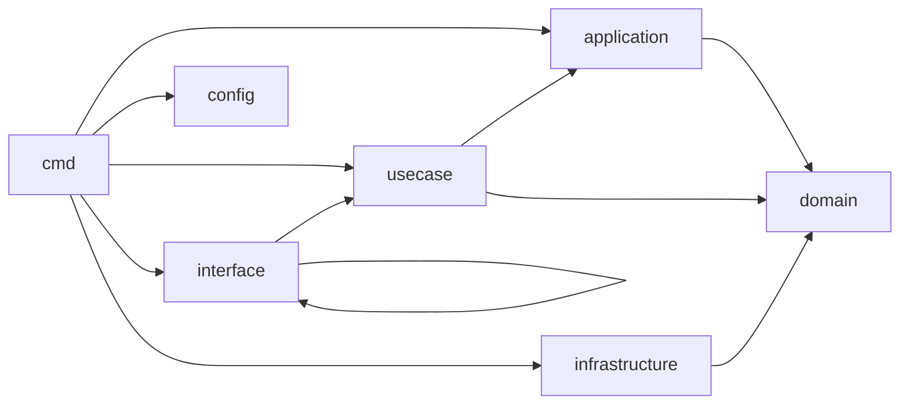

# CleanArch 依存マップ（Issue #12）

最終更新: 2026-02-14
対象リポジトリ: `kuro48/idol-database`

## 1. 目的と範囲

クリーンアーキテクチャ移行（#11）の前提として、`cmd/api` と `internal/**` の依存関係を可視化する。

- 対象: `cmd/api`, `internal/config`, `internal/domain`, `internal/application`, `internal/usecase`, `internal/interface`, `internal/infrastructure`
- 手法: `go list` による import 解析

## 2. 依存抽出コマンド

```bash
go list -f '{{.ImportPath}}|{{range .Imports}}{{.}} {{end}}' ./cmd/... ./internal/...
```

## 3. 層間依存サマリ



| 依存方向 | 件数 |
|---|---:|
| `application -> domain` | 6 |
| `usecase -> application` | 9 |
| `usecase -> domain` | 6 |
| `interface -> usecase` | 6 |
| `interface -> interface` | 1 |
| `infrastructure -> domain` | 6 |
| `cmd -> application` | 6 |
| `cmd -> usecase` | 6 |
| `cmd -> interface` | 2 |
| `cmd -> infrastructure` | 2 |
| `cmd -> config` | 1 |

## 4. 主要パッケージ依存一覧（内部依存のみ）

| パッケージ | 依存先（内部） |
|---|---|
| `cmd/api` | `docs`, `internal/application/*`, `internal/usecase/*`, `internal/interface/{handlers,middleware}`, `internal/infrastructure/{database,persistence/mongodb}`, `internal/config` |
| `internal/application/*` | 各 `internal/domain/*` |
| `internal/usecase/agency` | `internal/application/agency`, `internal/domain/agency` |
| `internal/usecase/event` | `internal/application/event`, `internal/domain/event` |
| `internal/usecase/group` | `internal/application/group`, `internal/domain/group` |
| `internal/usecase/idol` | `internal/application/{idol,agency}`, `internal/domain/idol` |
| `internal/usecase/removal` | `internal/application/{removal,idol,group}`, `internal/domain/removal` |
| `internal/usecase/tag` | `internal/application/tag`, `internal/domain/tag` |
| `internal/interface/handlers` | `internal/interface/middleware`, `internal/usecase/*` |
| `internal/infrastructure/persistence/mongodb` | `internal/domain/*` |

## 5. 許容依存（現時点）

- `interface -> usecase`
- `usecase -> domain`
- `application -> domain`
- `infrastructure -> domain`
- `cmd -> *`（Composition Rootとして許容）

## 6. 境界違反候補（初版）

1. Domain層がMongoDBドライバに依存
- `internal/domain/removal/removal_id.go:6`
- `internal/domain/tag/value_object.go:7`
- 影響: `domain` が特定DB実装（`bson.ObjectID`）を知っている。

2. Interface middlewareがMongoDB固有エラー型に依存
- `internal/interface/middleware/error.go:10`
- 影響: HTTP層で永続化実装詳細（`mongo`）に結合。

3. UseCase層がApplication層へ直接依存
- 例: `internal/usecase/idol/service.go:12`
- 影響: 目標依存方向（`Entity <- UseCase <- Interface Adapter`）へ移行する際の段差。
- 補足: 現構成では移行途中設計としては成立しており、直ちに不正とは断定しない。

4. UseCase層が複数Applicationサービスを横断参照
- 例: `internal/usecase/removal/service.go:7`
- 影響: ユースケース境界の肥大化、責務重複の温床。

5. `cmd/api` が `application` と `usecase` の両方を同時配線
- `cmd/api/main.go:26`
- 影響: 依存注入方針が不統一で、ポート境界の見通しが悪化。

## 7. 次アクション（#13 接続）

- #13で上記候補を `High/Medium/Low` に優先度付けし、責務重複バックログへ昇格する。
- 特に `Domain層のMongo依存` は最優先候補として切り出す。
