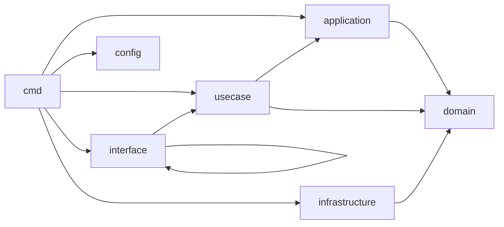
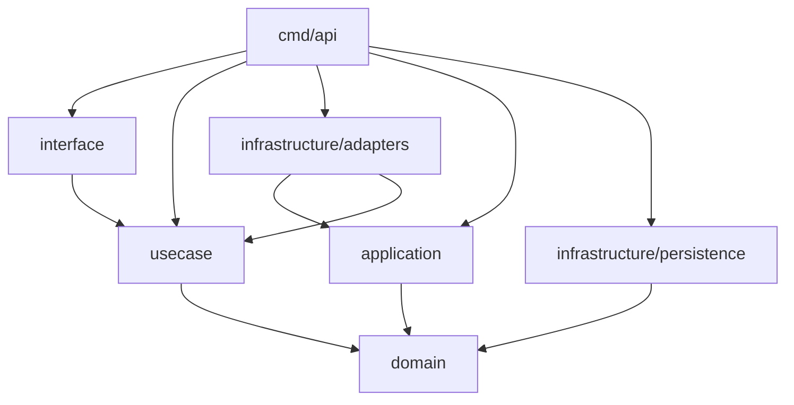

# CleanArch 依存マップ（Issue #12）

最終更新: 2026-03-12 (Clean Architecture M2 完了後に更新 - #83)
対象リポジトリ: `kuro48/idol-database`

## 1. 目的と範囲

クリーンアーキテクチャ移行（#11）の前提として、`cmd/api` と `internal/**` の依存関係を可視化する。

- 対象: `cmd/api`, `internal/config`, `internal/domain`, `internal/application`, `internal/usecase`, `internal/interface`, `internal/infrastructure`
- 手法: `go list` による import 解析

## 2. 依存抽出コマンド

```bash
go list -f '{{.ImportPath}}|{{range .Imports}}{{.}} {{end}}' ./cmd/... ./internal/...
```

## 3. 層間依存サマリ


```mermaid
graph LR
  CMD["cmd"] --> APP["application"]
  CMD --> UC["usecase"]
  CMD --> IF["interface"]
  CMD --> INF["infrastructure"]
  CMD --> CFG["config"]
  APP --> DOM["domain"]
  UC --> APP
  UC --> DOM
  IF --> UC
  IF --> IF
  INF --> DOM
```

> **注**: M1（2026-02-14）時点の依存図。`UC --> APP` の矢印は M2 で解消済み。

### M2 後（2026-03-12）の依存図


```mermaid
graph TD
  CMD["cmd/api"] --> IF["interface"]
  CMD --> UC["usecase"]
  CMD --> ADAPTERS["infrastructure/adapters"]
  CMD --> APP["application"]
  CMD --> INF["infrastructure/persistence"]
  IF --> UC
  ADAPTERS --> APP
  ADAPTERS --> UC
  APP --> DOM["domain"]
  UC --> DOM
  INF --> DOM
```

`usecase → application` の直接依存が **adapters 経由** に変わり、usecase は domain のみに依存。

| 依存方向 | M1 | M2 |
|---|---:|---:|
| `application -> domain` | 6 | 6 |
| `usecase -> application` | **9** | **0** ✅ |
| `usecase -> domain` | 6 | 6 |
| `adapters -> application` | 0 | 7 |
| `adapters -> usecase` | 0 | 7 |
| `interface -> usecase` | 6 | 6 |
| `infrastructure -> domain` | 6 | 6 |
| `cmd -> application` | 6 | 6 |
| `cmd -> usecase` | 6 | 6 |

## 4. 主要パッケージ依存一覧（M2 後）

| パッケージ | 依存先（内部） |
|---|---|
| `cmd/api` | `internal/application/*`, `internal/usecase/*`, `internal/interface/*`, `internal/infrastructure/*`, `internal/config` |
| `internal/application/*` | 各 `internal/domain/*` |
| `internal/usecase/idol` | `internal/domain/idol`, `internal/domain/agency` |
| `internal/usecase/removal` | `internal/domain/removal`, `internal/domain/idol`, `internal/domain/group` |
| `internal/usecase/{group,agency,event,tag}` | 各 `internal/domain/*` |
| `internal/infrastructure/adapters` | `internal/application/*`, `internal/usecase/*`, `internal/domain/*` |
| `internal/interface/handlers` | `internal/interface/middleware`, `internal/usecase/*` |
| `internal/infrastructure/persistence/mongodb` | `internal/domain/*` |

## 5. 許容依存（M2 後）

- `interface -> usecase`
- `usecase -> domain` のみ（usecase → application は禁止）
- `application -> domain`
- `adapters -> application, usecase, domain`（Output Port の bridge として許容）
- `infrastructure/persistence -> domain`
- `cmd -> *`（Composition Root として許容）

## 6. 境界違反一覧（M1 → M2 対応状況）

| # | 違反内容 | M1 状態 | M2 後 |
|---|---------|---------|------|
| 1 | Domain 層が MongoDB ドライバに依存 | 未対応 | **残課題** |
| 2 | Interface middleware が MongoDB エラー型に依存 | 未対応 | **残課題** |
| 3 | UseCase 層が Application 層へ直接依存 | 9件 | **✅ 解消**（Epic #83） |
| 4 | UseCase 層が複数 Application サービスを横断参照 | あり | **✅ 解消**（Output Port で整理） |
| 5 | cmd/api の DI 配線が不統一 | あり | **✅ 改善**（adapters 経由に統一） |

### 残課題（M3 候補）

1. **Domain 層の MongoDB 依存**
   - `internal/domain/removal/removal_id.go:6`
   - `internal/domain/tag/value_object.go:7`
   - 対処: `bson.ObjectID` を domain から分離するか、Infrastructure 層で変換

2. **Interface middleware の MongoDB エラー型依存**
   - `internal/interface/middleware/error.go:10`
   - 対処: `mongo.WriteException` などを domain エラー型に変換するアダプターを追加

## 7. 次アクション

- Domain 層の MongoDB 依存を Medium 優先度として次 Milestone に設定する。
- CI boundary-check が全て GREEN であることを継続的に確認する。
