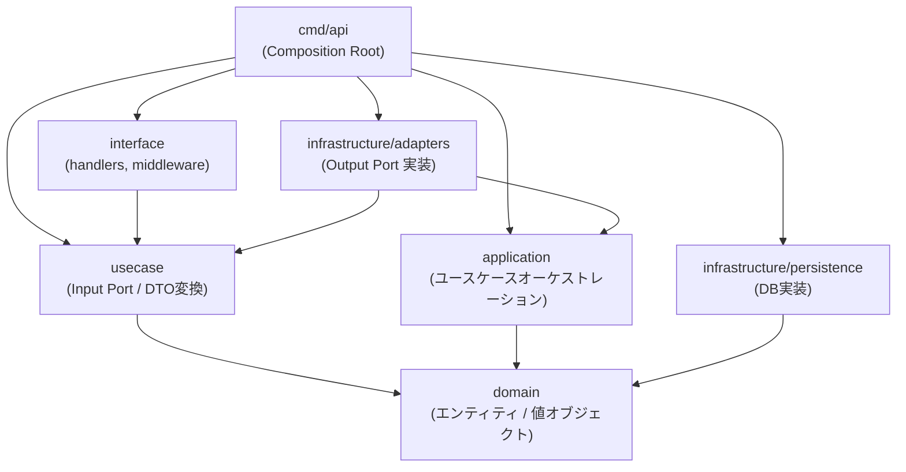

# レイヤー境界とOutput Port設計 (Clean Architecture M2)

最終更新: 2026-03-12
対象 PR: #89, #90, #91, #92 (Clean Architecture M2 - Epic #83)

---

## 1. レイヤー依存方向



**依存の方向原則**: 外側のレイヤーが内側に依存する。内側は外側を知らない。

---

## 2. 各レイヤーの責務

| レイヤー | パッケージ | 責務 | 依存可能な先 |
|---------|----------|------|------------|
| **domain** | `internal/domain/*` | エンティティ・値オブジェクト・ドメインサービス・リポジトリInterface | なし（内部のみ） |
| **application** | `internal/application/*` | ドメインオブジェクトのオーケストレーション・トランザクション境界 | `domain` |
| **usecase** | `internal/usecase/*` | HTTP ユースケース・DTO変換・Input/Output Port 定義 | `domain` のみ |
| **infrastructure/adapters** | `internal/infrastructure/adapters` | usecase Output Port を application サービスに橋渡し | `application`, `usecase`, `domain` |
| **infrastructure/persistence** | `internal/infrastructure/persistence/*` | リポジトリの DB 実装 | `domain` |
| **interface** | `internal/interface/*` | HTTP ハンドラー・ミドルウェア | `usecase`, `interface` |
| **cmd/api** | `cmd/api` | Composition Root（全レイヤーの配線） | 全て |

---

## 3. Output Port パターン

Clean Architecture M2 で導入した **Output Port** の設計を説明する。

### 3.1 なぜ usecase が application を直接 import してはならないか

M1（M2以前）の状態:
```
usecase/idol/service.go
  ├── import appIdol "internal/application/idol"   ← 違反
  └── import appAgency "internal/application/agency"  ← 違反
```

問題点:
- usecase 層が application 層の具体的な実装（`*ApplicationService`）に依存
- application サービスのメソッドシグネチャが変わると usecase も壊れる
- テスト時にモックが作れず、application + domain + DB まで全て必要になる

### 3.2 M2 後の構造

```
usecase/idol/
  ├── port_in.go   # Input Port（interface層が依存）
  ├── port_out.go  # Output Port（usecase が定義、adapters が実装）
  └── service.go   # port_out.go の interface のみに依存

infrastructure/adapters/
  └── idol_adapter.go  # application.ApplicationService を IdolAppPort に適合
```

### 3.3 Output Port Interface の例

```go
// internal/usecase/idol/port_out.go
package idol

// IdolAppPort は idol.Usecase が要求する契約（Output Port）
// usecase 層はこの interface にのみ依存し、application 層を直接知らない
type IdolAppPort interface {
    CreateIdol(ctx context.Context, input IdolCreateInput) (*domain.Idol, error)
    GetIdol(ctx context.Context, id string) (*domain.Idol, error)
    // ...
}
```

```go
// internal/infrastructure/adapters/idol_adapter.go
package adapters

// IdolAppAdapter は appIdol.ApplicationService を ucIdol.IdolAppPort に適合させる
type IdolAppAdapter struct {
    svc *appIdol.ApplicationService
}

func (a *IdolAppAdapter) CreateIdol(ctx context.Context, input ucIdol.IdolCreateInput) (*idolDomain.Idol, error) {
    return a.svc.CreateIdol(ctx, appIdol.CreateInput{
        Name:      input.Name,
        Birthdate: input.Birthdate,
        AgencyID:  input.AgencyID,
    })
}
```

```go
// cmd/api/main.go （Composition Root）
idolAppPort := adapters.NewIdolAppAdapter(idolAppService)
idolUsecase := usecaseIdol.NewUsecase(idolAppPort, agencyAppPort)
```

---

## 4. Input と Output の Input 型について

### なぜ usecase/port_out.go に Input 型を定義するか

application 層の Input 型（例: `appIdol.CreateInput`）は application 層の実装詳細。
usecase が直接使うと application への依存が生まれる。

解決策: usecase 層が自分用の Input 型を定義し、adapter が変換を担う。

```
ucIdol.IdolCreateInput  →  (adapter が変換)  →  appIdol.CreateInput
```

これにより usecase は application 層の型定義を知る必要がない。

---

## 5. CI による境界保護

`.github/workflows/ci.yml` の `boundary-check` ジョブが以下を自動検証:

| チェック | 内容 |
|---------|------|
| domain boundary | domain が application/usecase/interface/infrastructure を import しない |
| application boundary | application が usecase/interface を import しない |
| infrastructure (non-adapters) boundary | persistence/database が usecase/interface を import しない |
| **usecase → application boundary** | usecase が application を直接 import しない（M2 で追加） |

**注意**: `infrastructure/adapters/` は usecase と application の橋渡し役のため、上記 infrastructure チェックの例外。

---

## 6. 今後の課題

| 課題 | 優先度 | 関連 Issue |
|-----|-------|-----------|
| Domain 層の MongoDB 依存（`bson.ObjectID`） | Medium | - |
| Interface middleware の MongoDB エラー型依存 | Low | - |
| usecase 層をまたぐ横断的関心事の整理 | Low | - |
